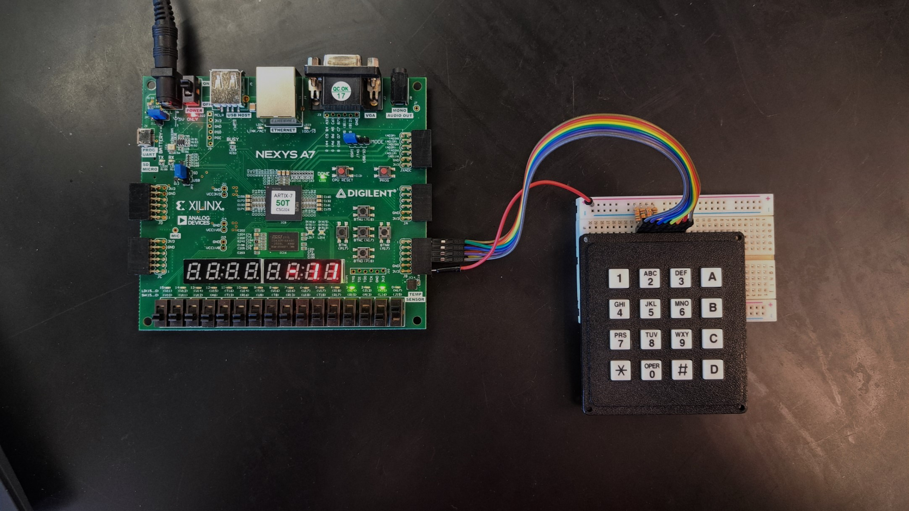

# Calculator with FPGA

## Introduction 
* This project uses NEXYS DDR4 board to do integer calculation such as addition, subtraction, multiplication and division.

* The following table shows each operations for each letter on the keypad.

| Keypad | Operation |
|--------|-----------|
| A      | Addition  |  
| B | Subtraction    | 
| C | Multiplication |
| D | Division       |
| * | Negation       | 
| = | Equal or Accessing Memory | 

* A 4x4 keypad is used to do the operation, connected via Pmod Header.

* Please refer to the XDC file to view the connection of the Pmod header.

* A memory that's made up using registers can store the most recent 8 calculations done.

* To access the memory, hold the "=" key for 2 seconds to access the memory. Use "A" and "D" to cycle the memory.

* The calculation is displayed via the NEXYS DDR4 7-segement display.

* To reaccess back to the calculation mode, hold the "=" key for 2 seconds. 

## Calculator operation information 
* The 7 segment display has 8 numbers that can be used for display.

* Counting from left, digit 4 to 8 is for numbers / calculation. (4 digits + 1 negative sign)

* Counting from left, digit 1 to 3 is for memory storage.

* The 4 LED to the most right is displayed visually to see if the calculator is in addition, subtraction, multiplication, or division. 

* The 4 LED operates as follows:

| LED  | Operation     | 
|------|---------------|
| 1010 | Addition      | 
| 1011 | Subtraction   | 
| 1100 | Multiplication| 
| 1101 | Division      | 

## Program / Hardware requirements

### Program 
* Vivado 2019.1 version

> **Note**: Vivado 2019.1 version is deprecated. Please use Vivado 2023 version from this [link](https://www.xilinx.com/support/download.html).

> If you are using a version higher than Vivado 2019.1, note that Vivado will prompt to auto-update it to the newest version. Selecte auto-update and proceed. 

> The application itself is **NOT** backwards compatible.

### Hardware
* Xilinx NEXYS A7 50T / 100T
* 4x4 keypad
* Male to male wire jumper * 9
* 1K - 10K Pull Up Resistor * 4 (tied high to column)

* A 4x4 keypad. Keypad can be purchased via this [link](https://www.amazon.com/Matrix-Membrane-Keyboard-Arduino-MicrocontrollerWIshioT/dp/B07B4DR5SH/ref=asc_df_B07B4DR5SH/?tag=hyprod-20&linkCode=df0&hvadid=459641693740&hvpos=&hvnetw=g&hvrand=11472968615419084120&hvpone=&hvptwo=&hvqmt=&hvdev=c&hvdvcmdl=&hvlocint=&hvlocphy=9020068&hvtargid=pla-942741144682&psc=1&mcid=0634068134253779bfedfe6580e15e3c).

[def]: Se